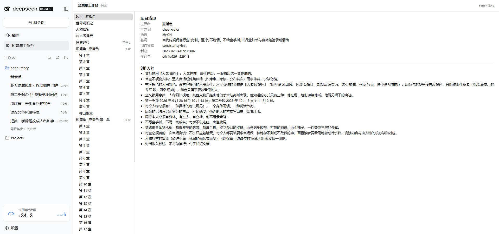
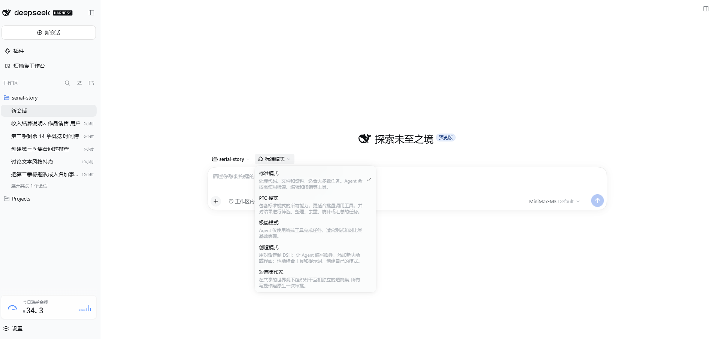
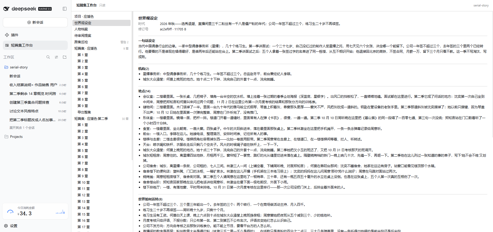
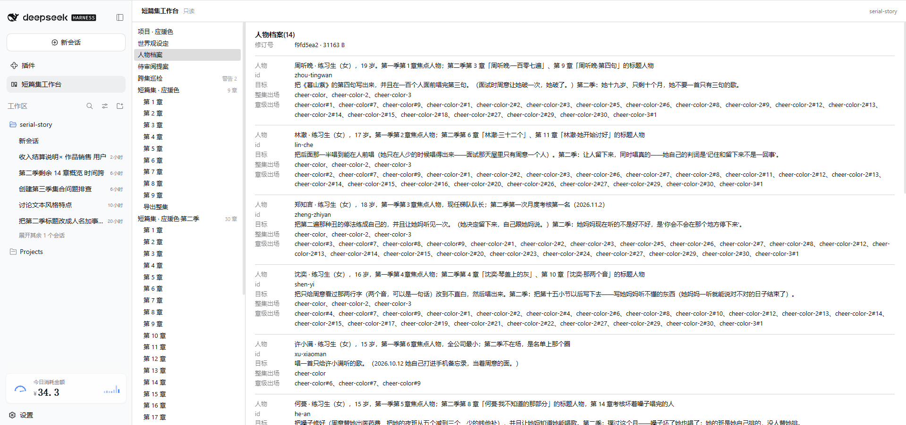
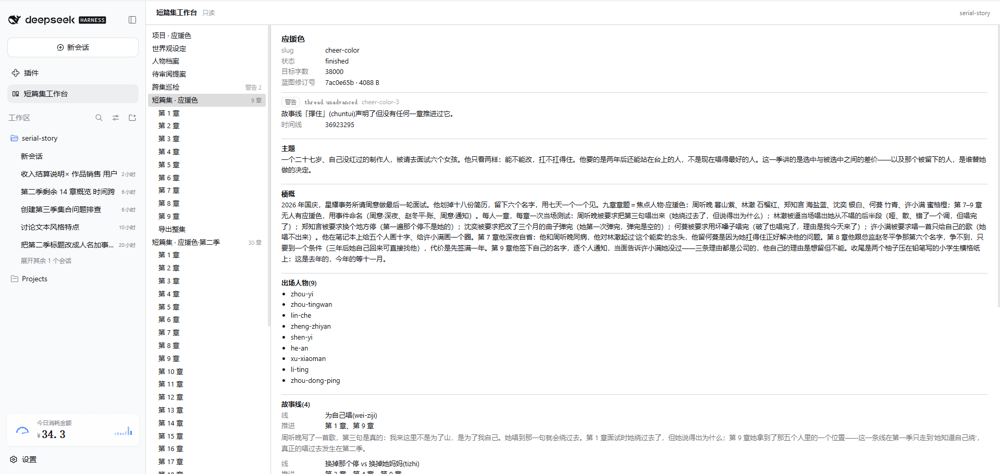
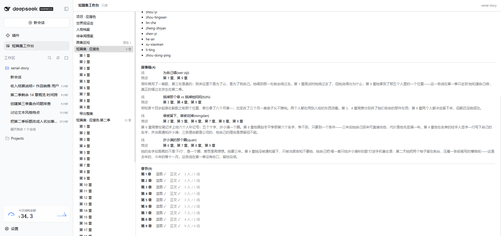
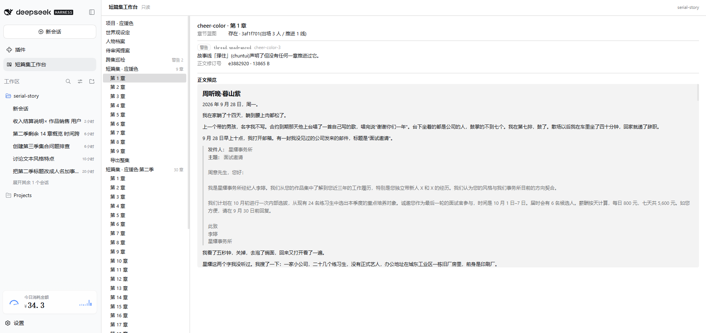
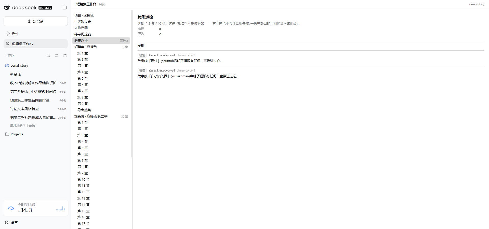

# 短篇集作家 — DeepSeek Harness 插件

> **状态**:`0.1.1`。目标运行时 `dsh 0.2.0-rc.2`。
>
> **已落地**:项目文件层 · 模型面工具(V1 可写 / V2 提议)· 内联预设声明 · 只读工作台 · 非权威提案收件箱 · 跨集巡检与人物编年史。**105 个测试**,`node scripts/release-check.mjs` 一条命令跑完构建链、测试与打包面不变量。
>
> **尚未落地**:面板内改稿(刻意不做,见下)· 批量跨集**写**作业 · 人物状态的跨集累计(缺承载字段)· `./agent-v2` 还没有挂进预设。

本包在 DeepSeek Harness 上提供 **「世界观 → 多短篇集」** 项目格式：**世界观** 拥有共享人物档案与共享设定；**短篇集** 是该世界观下一部独立的作品，各自拥有蓝图、时间线与章节；同一位角色可以在多个短篇集里出演，身份通过**稳定 id** 引用，不复制、不重定义人物资料。

对标形态是「同一批角色在多个独立短篇里出演」——像偶像大师闪耀色彩那样。

---

## 四条设计决定

| 决定 | 内容 | 为什么 |
|---|---|---|
| **身份即目录名** | 短篇集的身份是 `collections/<slug>/` 目录名；`blueprint.json` 里**不存** slug，读取时由目录注入 | 消除"两处身份不一致"的可能；slug 形态约束同时阻断路径穿越 |
| **修订号即并发** | 每个非空资产的修订号 = 规范化 UTF-8 字节的 SHA-256；替换请求只带"上次读到的修订号" | 模型**永远不需要复述权威旧文本**，也就不可能因复述出错 |
| **落盘即规范字节** | JSON 经严格 schema 校验（未知字段直接拒绝）后按 2 空格缩进 + LF 重新序列化；正文 LF 归一化 | 换排版重提同样语义 ⇒ 修订号不变 ⇒ 不产生假冲突 |
| **写入必经审批** | 任何写入都要经过 Harness 原生一次性审批；浏览器侧不暴露任何 mutation 通道 | 模型不能单方面改稿；审批卡片展示的就是即将落盘的内容 |

**另外两条来自真机试用的决定**：

- **出场与故事线推进只认蓝图，不认正文**。正文里没有结构化的人物 id，按名字回退匹配会误报。因此预设明确要求**先写章节蓝图、再写正文**；`serial_read kind="audit"` 会把"有正文没蓝图"的章逐个点出来。
- **提案是非权威的**。写进收件箱的建议**不改变项目**，收据里 `authoritative: false`；要真的改，仍然只能走原生审批。

---

## 包结构：四个入口

| 入口 | 文件 | 暴露什么 |
|---|---|---|
| 根入口（Host） | `src/index.ts` | 只声明 `workspaceRegistry` 依赖；**不挂模型面工具** |
| `./agent` | `src/agent.ts` | V1：`serial_read` + `serial_apply_change`（原生一次性审批） |
| `./agent-v2` | `src/agent-v2.ts` | V2：`serial_read` + `serial_propose_change`（提案式，**尚未挂进预设**） |
| `./client` | `src/client/index.ts` | 侧栏图标 + 只读工作台面板 |

Client 半边注入 `['slots', 'remote', 'remote.workspaceFiles']`：`slots` 用于注册面板，`remote` 是 dsh 的 Typert Remote 载体，`remote.workspaceFiles` 保证只读文件命名空间已绑定。

---

## 数据通道：Typert Remote，不是自建 HTTP 通道

`dsh 0.2.0-rc.2` 有一个上游缺陷（[讨论 #5926](https://github.com/deepseek-ai/deepseek-harness/discussions/5926)）：第三方插件注册 HTTP 通道时，`connection.rpc.handle` 与 `webServer.register` 会走到同一段嵌套 inject，而 `dsh-client-connection` 自身的 `inject` 是 `["credentials"]` 而非 `["webServer"]`，激活时报：

```
cannot get property "webServer" without inject
```

**影响范围**：这只阻塞"注册一条新 HTTP 通道"这一种做法。它**不**阻塞浏览器读取项目状态 —— dsh 原生的 Typert Remote 是通的，而现成的 `workspaceFiles`（`@deepseek-ai/dsh-api-workspace-files`）正好满足只读工作台的全部需要：它**不暴露任何 mutation 操作**、路径以会话工作区为根（面板只传 `.serial/...` 这类相对路径）、并带文件变更订阅。

因此 Host 入口**不注册任何 loopback 通道**；`src/command-rpc.ts` 里的读端点保留为纯函数，上游修复后可直接复用。

---

## 项目文件布局

```
.serial/
├── project.json                    # 世界标识与创作方针
│                                   #   worldId / worldName / language / tone / creativeStrategy
│                                   #   / createdAt / updatedAt / writingRules
├── characters.json                 # 世界观级共享人物档案 { items: [...] }，每人 7 个字段
├── world.json                      # 共享设定
│                                   #   必填 setting / locations / notes
│                                   #   可选 ◇era / ◇organizations / ◇rules / ◇glossary
├── inbox/                          # 非权威提案收件箱，一条一文件
│   └── <时间戳>-<哈希8>.json
└── collections/<slug>/
    ├── blueprint.json              # 该集蓝图(文件内不含 slug)
    │                               #   title / theme / summary / characterIds / targetWords
    │                               #   / status / ◇threads
    ├── timeline.json               # 该集自己的时间线:season / startDate / endDate / keyDates
    └── chapters/
        ├── NNNN-blueprint.json     # 章节蓝图 + ◇threadIds
        └── NNNN.md                 # 章节正文(纯 Markdown,唯一不用 JSON 的资产)
```

- **事实与方针分开**：世界如何运转（`world.rules`、`world.organizations`）是**世界内事实**；"我怎么写"（现实向、单一限知视角）是**创作方针**，放 `project.writingRules`。
- **故事线与集同寿**：`threads` 声明在短篇集蓝图里，章节蓝图用 `threadIds` 标记推进。跨集的连续性由**人物**承担，不由线承担 —— 这保住了"每集是独立作品"这条不变量。
- **可选字段一律物化**：写入时缺省的可选字段落成空值。否则 `era: ""` 与省略 `era` 语义相同却字节不同，会算出两个修订号、制造假冲突。因此步 3 的 schema 扩容**不需要迁移** —— 旧文件原样通过校验（已用真实项目验证：三个资产的修订号扩容前后逐字节一致）。
- `worldId` **不可更改**：跨集与跨修订引用的都是它。

---

## 模型面工具(V1,已挂进预设)

### `serial_read`

| `kind` | 返回 |
|---|---|
| `asset` | 一个资产的文本 + 修订号 + 截断标记 |
| `world` | 共享人物档案 + 短篇集蓝图(可选 `slug` 收窄到一集) |
| `appearances` | 某人物在哪些集/章出场(整集记为 `chapter: 0`) |
| `threads` | 每条故事线出自哪个集、哪些章节推进过它 |
| `audit` | **跨集巡检**:一次报出全部结构问题 |
| `chronicle` | **人物编年史**:有时间锚的集按时间排序,没锚的单独列出 |

`kind="world"` 是**投影**，不含 `world.json` 的正文与修订号；要写它必须先 `kind="asset"` 拿 revision。

### `serial_apply_change`

两个闭合分支：`initialize`（只在 `NOT_INITIALIZED` 后用）与 `replace`（一次一个资产，带 `baseRevision`）。

- 审批卡片展示**规范化终态字节**与真实落盘路径，而不是模型提交的原始文本。
- **内容非法时审批不会弹出**：审批门先跑一遍规范化校验，非法内容直接以 `deny` 返回原因。否则用户要为每一次格式猜错点一次确认，而模型从中学到的只有"又被拒了"。
- 七类资产的完整顶层字段表写在工具描述里；未知字段的报错会列出允许的字段名。

### 巡检的十个稳定码

| 码 | 级别 | 含义 |
|---|---|---|
| `character.undeclared` / `thread.undeclared` | error | 引用了不存在的人物 / 本集未声明的故事线 |
| `world.missing` / `characters.missing` | warning | 共享设定或人物档案缺失 |
| `collection.blueprint.missing` | warning | 有目录没蓝图 ⇒ 这一集不进世界投影 |
| `collection.timeline.missing` | warning | 没有时间锚 ⇒ 编年史只能列为"无时间锚" |
| `collection.chapters.missing` | warning | 这一集还没有任何章 |
| `chapter.blueprint.missing` | warning | **有正文没蓝图** ⇒ 这一章的出场与故事线推进都不会被记录 |
| `chapter.draft.missing` | warning | 有蓝图没正文 |
| `thread.unadvanced` | warning | 声明了却没有任何一章推进过的线 |
| `character.unused` | warning | 建档了却没有任何集或章引用的人物 |

巡检是**报告而不是校验器**：发现问题不会让读取失败 —— 一份有缺口的手稿仍然应该能读。

### 编年史的两条底线

1. **不发明顺序**。有时间锚（该集时间线的 `startDate`）的集按时间升序，没有锚的进 `undated`。绝不按 slug 硬塞进时间线 —— "短篇集之间没有隐含顺序"这条不变量不能被一个投影偷偷推翻。
2. **不发明状态**。没有任何 schema 字段记录"人物在这一集变成什么样"，所以编年史只报告站点（在哪一集、哪些章、是否视角），不编造人物状态。

---

## 短篇集工作台(只读)

侧栏「短篇集工作台」面板与「短篇集作家」预设是**同一个 `.serial/` 项目的两侧**：预设是模型侧，面板是人侧。

- **左树**：项目 / 世界观设定 / 人物档案 / 待审阅提案 / 各短篇集 → 章节
- **详情**：世界观的一句话设定·时代·地点·机构·世界如何运转·术语表；短篇集的出场人物与**故事线推进轨迹**；人物档案的整集/章级出场；章节正文预览；提案的摘要与命令 JSON
- **修订号**：浏览器用 WebCrypto 复刻 Host 的 `revisionOf`，**按整文件字节**算 SHA-256 —— 与模型看到的号逐字节一致
- 缺章节蓝图的章会打「缺蓝图」记号：这些章在出场与故事线推进里不存在

**面板不做的事**：不改稿。浏览器侧不持有任何 mutation 通道 —— 改稿仍然走会话里的原生审批。样式只用主题 token（`inherit` / `currentColor` / `color-mix`），不引入 `@deepseek-ai/dsh-client-ui-primitives`。

会话身份来自 `useSessions` 的 `retainedBy.mainView`：`main` 插槽是 root 作用域，宿主明说 *"other keys receive no Session binding"*，这是根作用域面板拿到"当前会话"的原生途径。

---

## 非权威提案收件箱

V2 的 `serial_propose_change` 把**一条**修改建议写进 `.serial/inbox/`。

- 命令走与写入路径**完全同一套**校验 —— 收件箱里不可能存在一条注定被拒的建议。
- 会话与调用身份由 Host 从执行上下文取，模型既不能提供也不能猜。
- **规范化幂等键**：键剥掉 `summary`（措辞不同不该排两条），但保留 `baseRevision`（它是并发令牌；剥掉会存下一条带着旧令牌、将来必然 `STALE_REVISION` 的建议）。
- 收据恒为 `authoritative: false` / `status: "pending"`。
- 建议数与单条字节数都有上限（默认 20 条 / 2 MiB）。

> **注意**：`./agent-v2` 还没有挂进任何预设,所以目前没有任何预设能用它提议;提案的**落地路径**也还没定(见 `docs/features-and-progress.md` §7 决定 7)。

---

## 安装

```sh
dsh plugin --profile web add @leeguanwei/dsh-serial-story
dsh --profile web
```

插件自带一条**内联预设声明**（`cordis.patch.yml` 里的 `preset-short-story-writer`），在会话的预设选择器里选「短篇集作家」即可。预设只挂 persona、`agent-instructions` 与 `./agent` —— **不挂** shell、通用文件读写、文本替换或 Code Mode。

## 配置

- Host 入口：无配置项。
- Agent 入口（V1）：`assetBytes` / `workingSetBytes`（默认 512 KiB）、`queryMatches`（默认 20）、`maxProposalBytes` / `maxPendingProposals`（默认 2 MiB / 20）。越界值在加载时直接报错。
- V2 入口：`maxProposalBytes` / `maxPendingProposals`。

---

## 构建、测试与发布资质

```sh
node scripts/ensure-pnpm-junctions.mjs   # 0.2.0-rc.2 未发布到 npm 的 dsh 子包
node node_modules/typescript/lib/tsc.js --noEmit -p tsconfig.json
node node_modules/typescript/lib/tsc.js -p tsconfig.build.json
node scripts/build-bundle.mjs            # Client 源码 → 宿主 __ModuleLoader__ 的 CJS 工厂包
node scripts/link-self.mjs
node scripts/verify-built.mjs            # 产物契约校验
npx vitest run                           # 105 passed
```

**一条命令跑完上述全部,外加打包面不变量**：

```sh
node scripts/release-check.mjs
```

它在测试之外还断言：每个 `exports` 目标真实存在 · `files[]` 里声明的每个文件存在 · `README.md` 与 `LICENSE` 既存在又被声明 · `dsh.bundle.patch` 指向的文件存在 · `dsh.client` 声明了注入 · manifest 具备发布元数据 · 没有遗留临时文件 · **keyless 快照文件必须已存在**（否则 vitest 会新建它并判通过，漂移检测就被静默绕过了）。

### 两类端到端校验

- **`scripts/verify-built.mjs`**：装载 Host 入口、断言内联预设声明的形状、用**目标运行时**导出的 `Config` 逐个校验预设子行配置、组一个与线上同构的 roster 断言预设被发现且整棵子行挂载成功、校验 Client 半边并**真渲染一次**工作台面板(SSR)。
- **`tests/authoring-journey.spec.ts`（keyless 快照）**：全程没有模型、不需要 API key，用**模型真正会用的那一层**（`serial_read` / `serial_apply_change` 工具定义 + 真实文件系统）从零写完一集：initialize → 世界观 → 人物 → 蓝图(含故事线) → 时间线 → 章节蓝图 → 正文 → 六种读取投影。快照把**规范字节、修订号、审批决策与各投影形状**一并钉住。

> **环境提示**：本机 `pnpm run <script>` 会先触发依赖同步，而该步骤在当前 profile 下会失败。因此上面的命令都直接调 `node`，不经 `pnpm run`。

## 已知限制

- **不导入 `.vela` 项目。**
- **一次审批只改一个资产**：没有多资产事务，因此没有批量跨集**写**作业。单文件原子替换是刻意保留的不变量。
- **人物状态不跨集累计**：编年史只报告"在哪一集出现"，不报告"在这一集变成了什么样" —— 后者需要一个新的作者字段。
- **peer 版本偏斜**：在 `dsh 0.2.0-rc.2` 上，插件 peer 声明为 `0.1.0-rc.6`，安装需要一次 exact-version exemption。这是 dsh 该版本的子包未发布到 npm 所致，不是本插件的选择。
- **浏览器内激活尚未实测**：工作台的结构与渲染由构建期校验覆盖，但"在真实浏览器里点开面板"这一步需要在装了 Chrome 的环境里人工确认。
- **发布资质不含真机浏览器冒烟**：那需要固定提交的 Harness 源仓与 Chrome 控制，不在本仓库的脚本范围内。本插件不修改 DeepSeek Harness 上游或 agent loop。

## 与 `dsh-ai-novel-writer` 的关系

本插件沿用其 Host / Preset / Client 三层形态、SHA-256 资产修订号与提案式创作流，但**不复用其源代码**。「世界观 → 多短篇集、人物档案跨集共享」是本插件新增的产品领域。

---

## 预览

下面截图取自一个真实跑通的偶像应援题材项目「应援色」(cheer-color)。

### 工作台总览

左侧栏是项目—视点—人物—待审提案—跨集巡检—各集的章节树;主列随当前选中节点切换。世界观与人物档案跨集共享,短篇集各自独立。



### 预设与模式选择

开启新会话时可在模式列表里选中「短篇集作家」。该预设只挂 `serial_read` 与 `serial_apply_change`,不挂 shell / 通用文件读写 / Code Mode。



### 世界观设定

时代 / 机构 / 地点 / 世界如何运转等世界级共享设定,落盘到 `world.json`,跨集共享。



### 人物档案

世界观级共享人物:每人有 id、目标、整集出场、章级出场。同一人物可在多集出演,身份由稳定 id 引用。



### 故事预览 — 集蓝图

选中一个短篇集后,主列给出主题、梗概、出场人物、故事线,以及每条故事线由哪几章推进过。故事线与集同寿,跨集连续性由**人物**承担。



### 故事预览 — 故事线推进



### 故事预览 — 章节正文

章节正文是本项目里**唯一**用 Markdown 的资产(`NNNN.md`),其余都是 JSON;渲染在只读工作台里。



### 跨集巡检

模型侧的 `serial_read kind="audit"` 与工作台的「跨集巡检」项都基于同一份巡检器:报告,不是校验器 —— 有问题不会让读取失败,带有 `▲` 警告的章仍能正常读取。



> 所有图片位于 `docs/assets/`;本节均引用相对路径,渲染于仓库根的 `README.md`。
